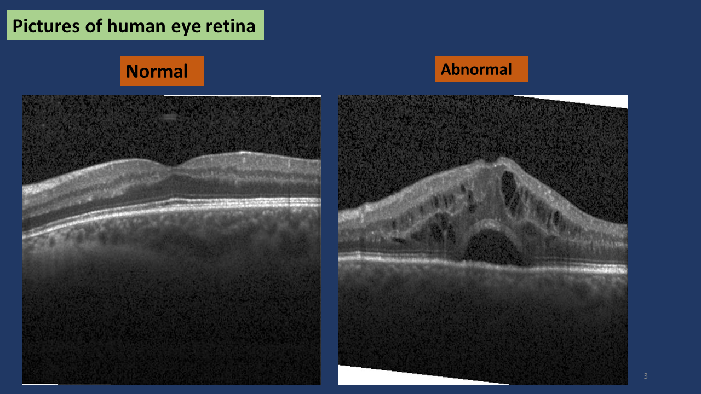
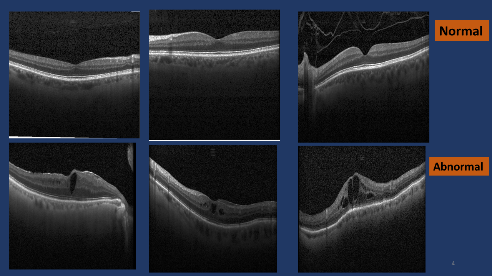
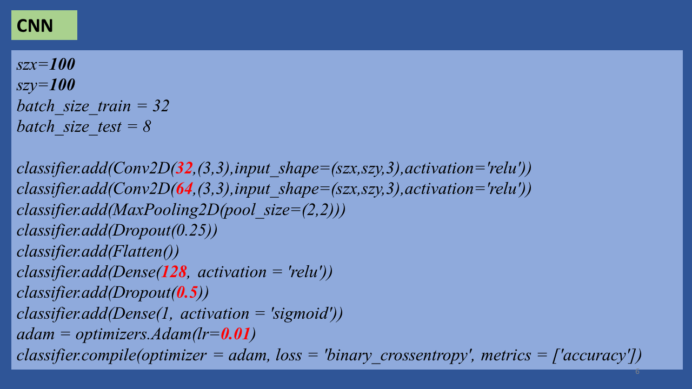
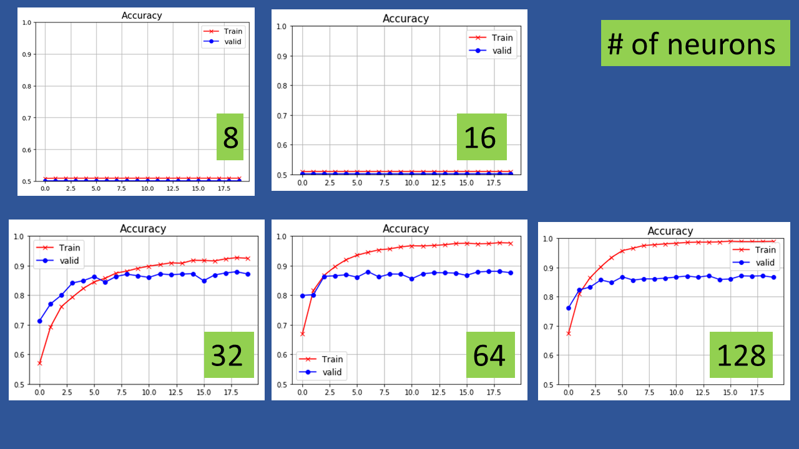

# image_classify_retina
Binary classification of retina images using CNN (Keras).

The dataset is balanced. There are 24000 images in each of the two classes. Out of these 75% are used for training and 6000 are used for testing. A simple Convolutional Neural Network (CNN) configuration is used.

 &nbsp;&nbsp;&nbsp;&nbsp;&nbsp;
  

  

The left side panel compares a normal retina image to abnormal retina image. The right side panel compares three images of each class. Clearly the abnormal images have perforations which distinguishes it from the normal retina images.

The following shows the basic configuration of CNN used in this work. There are two convolutional layers and one dense layer. The sensitivity of the accuracy to the number of neurons in the dense layer, the learning rate and dropout is explored.

 
The following shows the sensitivity of the accuracy to the number of neurons. For the configuration with 8 and 16 neurons there are too few neurons for the model to fit to the observations. Hence the accuracy is too low. With a the number of neurons equal to 128, the model is flexible enough to fit to the observations and hence the accuracy increases compared to the case of too few neurons. However, there is evidence of overfitting in that the training accuracy is close to 1 while the validation accuracy is much lower ( ~ 0.88). Decreasing the # of neurons to 32 gives a better result in that the overfitting decreases. This is quantified by the decrease in gap between the training and validation accuracy. The training accuracy is 0.92 and validation accuracy is 0.88. Consquently 32 is the best choice for this problem. 

 

  
